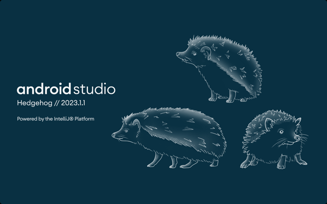

# android-learn

First kotlin, then Java.

## [Android 之 Compose 开发基础](https://developer.android.com/courses/android-basics-compose/course?hl=zh-cn)

### [第 1 单元：您的首个 Android 应用](https://developer.android.com/courses/android-basics-compose/unit-1?hl=zh-cn)

* GreetingCard
* HappyBirthday
* ComposeArticle
* TaskComplated
* ComposeQuadrant
* BusinessCard

### [第 2 单元：构建应用界面](https://developer.android.com/courses/android-basics-compose/unit-2?hl=zh-cn)

* KotlinLearn
* DiceRoller
* TipsTime

## 开发环境

[JDK 1.8.0_361](https://download.oracle.com/otn/java/jdk/8u361-b09/0ae14417abb444ebb02b9815e2103550/jdk-8u361-macosx-x64.dmg)

[Android Studio Hedgehog | 2023.1.1 Canary 10](https://r3---sn-j5o7dn7s.gvt1.com/edgedl/android/studio/ide-zips/2023.1.1.10/android-studio-2023.1.1.10-mac.zip)

